# FastAPI Architecture

```mermaid
flowchart LR
    Client["Client (Web/Gradio/API)"] --> App["FastAPI App<br/>app/main.py"]

    subgraph Middleware["Middleware Stack (config-driven)"]
        MW1["RequestLoggingMiddleware"]
        MW2["RateLimitMiddleware<br/>(local + Redis optional)"]
        MW3["TimeoutMiddleware"]
        MW4["BackpressureMiddleware<br/>(local + Redis optional)"]
        MW5["RouteMatchingMiddleware"]
    end

    App --> MW1 --> MW2 --> MW3 --> MW4 --> MW5

    subgraph API["Routers (/api/v1)"]
        Chat["chat.py<br/>POST /chat/stream<br/>GET /chat/{job_id}"]
        Eval["evaluation.py<br/>/eval/*"]
        Ops["ops.py<br/>GET /ops/status"]
    end

    MW5 --> Chat
    MW5 --> Eval
    MW5 --> Ops

    Auth["JWT Auth + RBAC<br/>api/dependencies/security.py"] -. depends .-> Chat
    Auth -. depends .-> Eval
    Auth -. depends .-> Ops

    Chat --> AsyncQueue["llm_async_queue_service<br/>enqueue_chat_job()"]
    AsyncQueue --> SQSJobs["AWS SQS<br/>LLM jobs queue"]
    AsyncQueue --> DDBJobs["DynamoDB<br/>LLM job result table"]
    Chat -->|poll status for SSE| DDBJobs

    subgraph Workers["Background Workers"]
        LLMWorker["scripts/llm_async_worker.py"]
        SummaryWorker["scripts/summary_worker.py"]
        MetricsWorker["scripts/metrics_aggregation_worker.py"]
        EvalWorker["scripts/eval_dynamodb_worker.py"]
    end

    SQSJobs --> LLMWorker
    LLMWorker --> LLMService["llm_service.generate_response()"]

    LLMService --> Guardrails["guardrails_service<br/>(input/context/output)"]
    LLMService --> RedisCache["Redis<br/>chat cache + latency metrics"]
    LLMService --> Memory["memory_service<br/>build_context/update_memory"]
    LLMService --> Retrieval["retrieval_service"]
    LLMService --> BedrockChat["AWS Bedrock Converse<br/>(primary/fallback)"]
    LLMService --> EvalTrace["evaluation_service.store_chat_trace()"]
    LLMService --> MetricsEvent["sqs_event_queue_service<br/>enqueue_metrics_record_event()"]

    Memory --> RedisMemory["Redis<br/>encrypted short-term memory"]
    Memory --> SummaryQueue["Redis Streams<br/>summary queue"]
    SummaryQueue --> SummaryWorker
    SummaryWorker --> BedrockSummary["AWS Bedrock<br/>summary generation"]
    SummaryWorker --> RedisMemory

    Retrieval --> Embedding["embedding_service<br/>Bedrock embeddings"]
    Embedding --> BedrockEmbed["AWS Bedrock invoke_model"]
    Retrieval --> Postgres["PostgreSQL + pgvector<br/>document_chunks search"]

    LLMWorker -->|mark processing/completed/failed| DDBJobs

    MetricsEvent --> SQSMetrics["AWS SQS<br/>metrics aggregation queue"]
    SQSMetrics --> MetricsWorker
    MetricsWorker --> MetricsJSON["metrics_json_service<br/>(JSON files)"]
    MetricsWorker --> MetricsDDB["metrics_dynamodb_service<br/>(DynamoDB aggregate)"]

    Eval --> EvalService["evaluation_service<br/>(conversation labels/report)"]
    Eval --> OfflineEval["offline_evaluation_service<br/>(status/run/report)"]
    OfflineEval --> EvalWorker
    OfflineEval --> DDBEval["DynamoDB<br/>offline evaluations table"]
    OfflineEval --> RedisLock["Redis<br/>scheduler leader lock"]

    Ops --> OpsService["ops_status_service"]
    OpsService --> RedisOps["Redis<br/>queue/latency/compaction metrics"]
```

## Notes

- `POST /api/v1/chat/stream` is queue-backed: it enqueues to SQS, then streams status/result by polling DynamoDB.
- Actual LLM execution happens in `scripts/llm_async_worker.py`, not in the API request thread.
- Short-term memory compaction is asynchronous via Redis Streams and `scripts/summary_worker.py`.
- Offline evaluation scheduling starts at FastAPI startup and is coordinated with a Redis leader lock.
